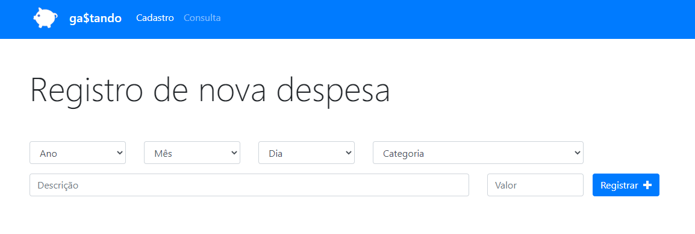
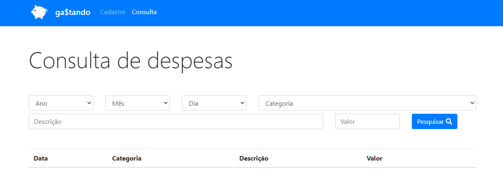

<p align="center">
  
</p>

## 🖥 Preview 

<p align="center">
  
  
</p>

---

## 📖 About

An application that allows the user to register his expenses and store them in the browser's localStorage. The user can eventually consult and/or remove his expenses.

---

## 🚀 What i've used

This project is developed with:

<span>
  
</span> 

<span>
  
</span>

<span>
  
</span>

<span>
  
</span>

---

## ⌨ How to run it

```bash
# Clone the repo
git clone https://github.com/vtorugo/gastando

# Run the index.html file inside the folder

```

---

Não meça os outros com sua própria régua.
